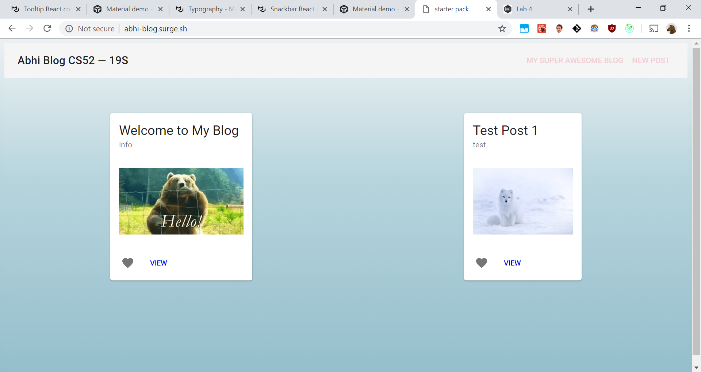
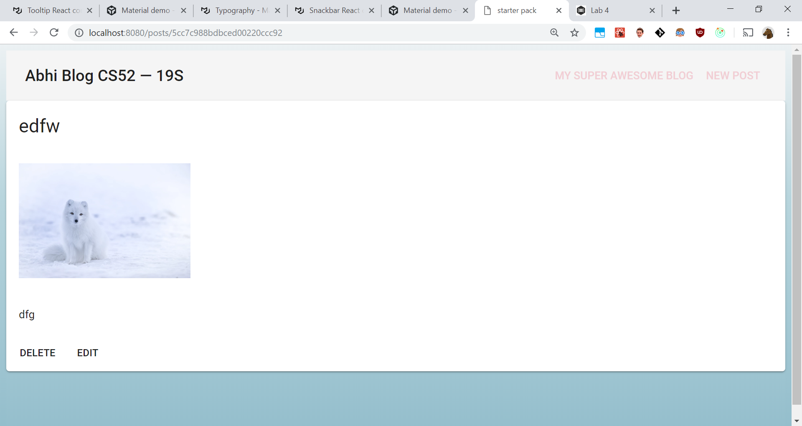

# Lab 3
## Abhimanyu Kapur

### Description
* A fun and ~ simple ~ blog CRUD web app to be used by anyone!!!

### What Worked (or Didn't)
* Got a much better understanding of redux and life cycle, and flow of control
* Planning components in advance and keeping it simple was helpful
* What didn't work was my understanding of reducers initially

### Extra Credit
* Styling
* Used Material UI (react components)
* Placeholder Values for the
* Input Validation
* Errors Display
* Default image if user doesn't input URL 
* Cancel/Reset Buttons when adding/editing posts

### Screenshots

